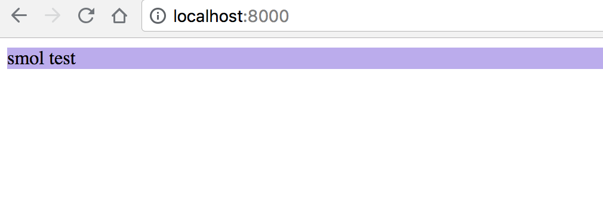

This repo is a tiny example in response to a question in [this great piece]() about CSS custom props by example.

## Example result:


---

To run clone this repo & start a server. If you have Python you can run:

```bash
python -m SimpleHTTPServer 8000
```

Then go to [http://localhost:8000/](http://localhost:8000/)
